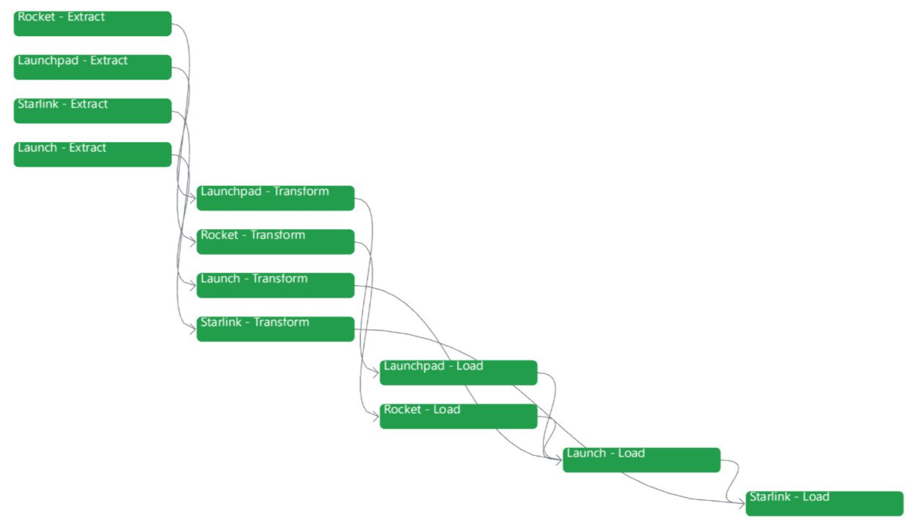
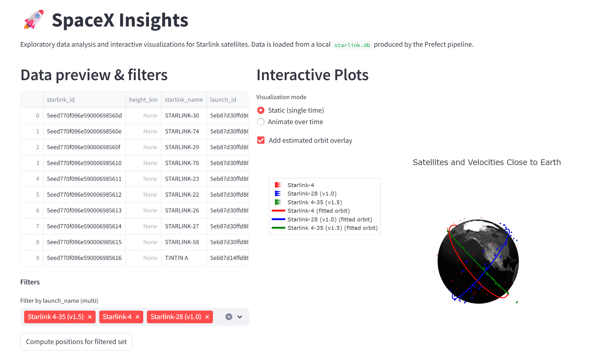
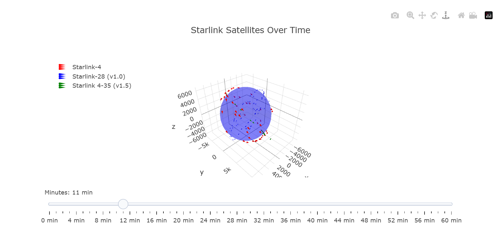
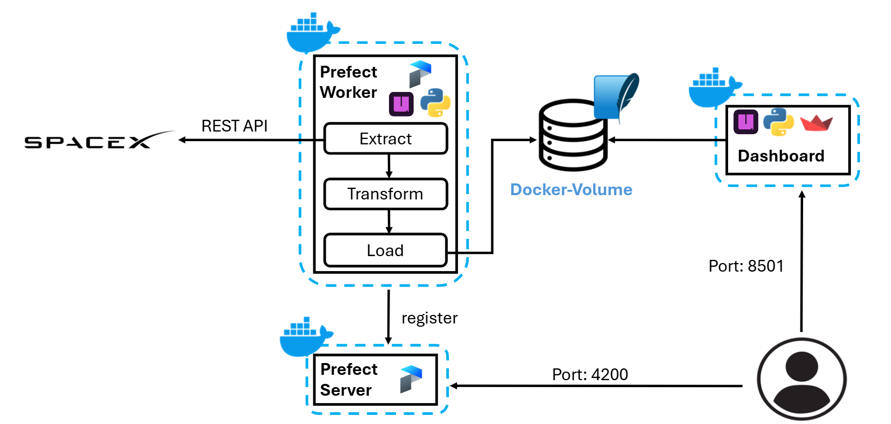

# SpaceX Insights — ETL Pipeline with Prefect & Docker

This project implements a fully containerized ETL pipeline using **Prefect**, **Docker**, and **Python**, designed to extract, transform, and load SpaceX open-source data into a SQLite database. A Streamlit web application container is included and ready for visualization.

---

## 1. Usage

### Prerequisites

* Docker Engine **20.10+** or Docker Desktop **4.0+**
* Docker Compose **v2.0+** (included by default with Docker Desktop)

### Start the Full Workflow

Make sure Docker Desktop is running, then simply execute:

```bash
docker-compose up --build
```

Docker will automatically

- Build all images
- Start Prefect server
- Run the ETL pipeline
- Generate the SQLite database (`starlink.db`)
- Start the Streamlit container
- Keep services running for demonstration

### Accessing the UIs

* **Prefect UI:** http://localhost:4200
* **Streamlit Web App:** http://localhost:8501

---

## 2. Quick preview

### ETL Pipeline



### Streamlit Dashboard

#### Dashboard overview & Static Plot Example



#### Animation Example



---

## 3. System workflow

The system automates the following workflow:

### Extract

- Fetch data from SpaceX public API:
  - Launches
  - Launchpads
  - Starlink satellites
  - Rockets

### Transform

- Parse JSON responses
- Normalize nested structures
- Select usable analytical fields

### Load

- Write cleaned tables into a SQLite database stored in a **shared Docker volume**

### Orchestrate

- Pipeline is managed by **Prefect**:
  - Logging
  - Retries
  - UI monitoring
  - Scheduling capability

### Visualize

- Serve interactive dashboards through **Streamlit**
- Load and display analytical tables from the generated SQLite database
- Provide visual insights into Starlink satellites through 3D interactive plots

---

## 4. Architecture Diagram



The project uses **docker-compose** to orchestrate three services:

| Service                  | Description                         |
| ------------------------ | ----------------------------------- |
| **prefect-server** | Prefect UI + API backend            |
| **etl-flow**       | Runs Prefect pipeline automatically |
| **streamlit-web**  | Hosts dashboard                     |

---

## 5. Technology Stack

- **Python 3.13**
- **Prefect 3**
- **Docker & Docker Compose**
- **SQLite**
- **uv** (for fast dependency management)
- **Streamlit** (interactive dashboard)

---

## 6. Why Prefect?

We chose **Prefect** because it offers:

- A modern workflow orchestration engine
- Friendly web dashboard
- Resilient retry behavior
- Easy deployment mechanisms
- Strong Python integration

---

## 7. Why Docker?

Docker ensures that:

- All teammates run identical environments
- No local Python installation conflicts
- The ETL and UI services run as isolated containers
- The database is persisted across runs
- The entire system is portable for grading/demo
